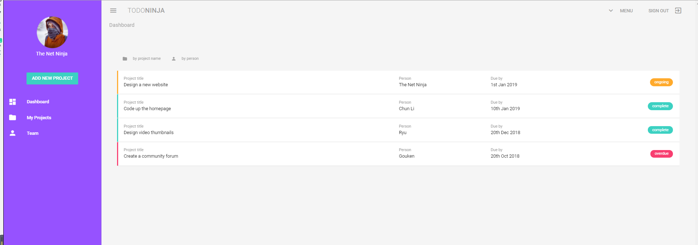
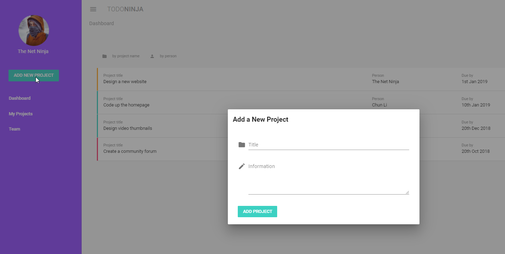
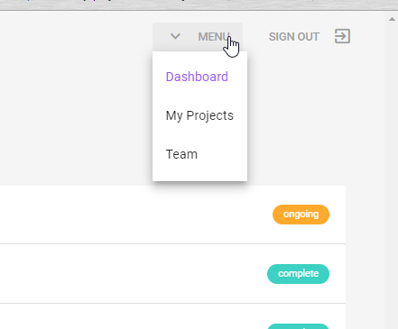
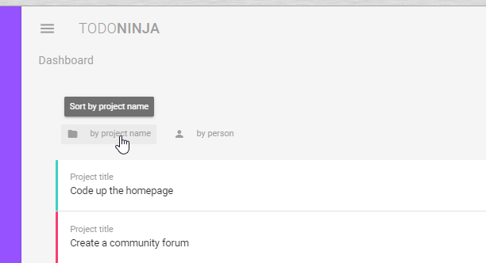

# todo-ninja

## Project setup
```
npm install
```

### Compiles and hot-reloads for development
```
npm run serve
```

### Compiles and minifies for production
```
npm run build
```

### Run your tests
```
npm run test
```

### Lints and fixes files
```
npm run lint
```









--------------------------------------------
https://jsfiddle.net/72r62kzy/21/

<ul class="thumb">
  <li>
    <div class="overlay">
      <a href="#"></a>
      <span class="time">3:28</span>
      <a href="#" class="playWrapper">
        <!--<span class="playBtn"></span>-->
      </a>
    </div>
    <div class="thumbCaption"><a href="">This is the description of the video...</a></div>
  </li>
  <li>
    <div class="overlay">
      <a href="#"></a>
      <span class="time">12:10</span>
      <a href="#" class="playWrapper">
        <span class="playBtn"></span>
      </a>
    </div>
    <div class="thumbCaption"><a href="">description goes here...</a></div>
  </li>
</ul>

.thumb { display: flex; flex-wrap: wrap; list-style: none; }

.thumb li { width: 193px; }

.thumb li ~ li { margin-left: 20px; }

.thumb .thumbCaption { padding: 10px 0; }

.overlay { position: relative; }

.overlay .thumbnail { display: block; }

.overlay .time { position: absolute; z-index: 2; right: 3px; bottom: 3px; padding: 2px 5px; background-color: rgba(0, 0,
0, 0.6); color: white; }

.overlay .playWrapper { opacity: 0; position: absolute; z-index: 1; top: 0; width: 192px; height: 109px; background:
rgba(0,0,0,0.6) url("http://wptf.com/wp-content/uploads/2014/05/play-button.png") no-repeat scroll center center / 50px
50px; }

.playWrapper .playBtn { position: absolute; z-index: 2; width: 50px; height: 50px; left: 0; right: 0; top: 0; bottom: 0;
margin: auto; /* center */ }

.thumb .overlay:hover .playWrapper { opacity: 1; }

---------------------------------------

      <v-layout row wrap>
        <v-flex xs12 sm6 md4 lg3 v-for="person in team" :key="person.name">
          <v-card class="text-xs-center ma-3">
            <v-responsive class="pt-4">
              <router-link to="/">
                <v-avatar size="100">
                  
                  <span class="playIcon">  </span>
                </v-avatar>
              </router-link>
            </v-responsive>

            <v-card-actions>
              <v-btn flat color="grey">
                <v-icon small left>message</v-icon>
                <span class="">Message</span>
              </v-btn>
              <v-spacer></v-spacer>
              <v-btn flat color="grey">
                <v-icon small left>message</v-icon>
                <span class="">Message</span>
              </v-btn>
            </v-card-actions>
          </v-card>
        </v-flex>
      </v-layout>

